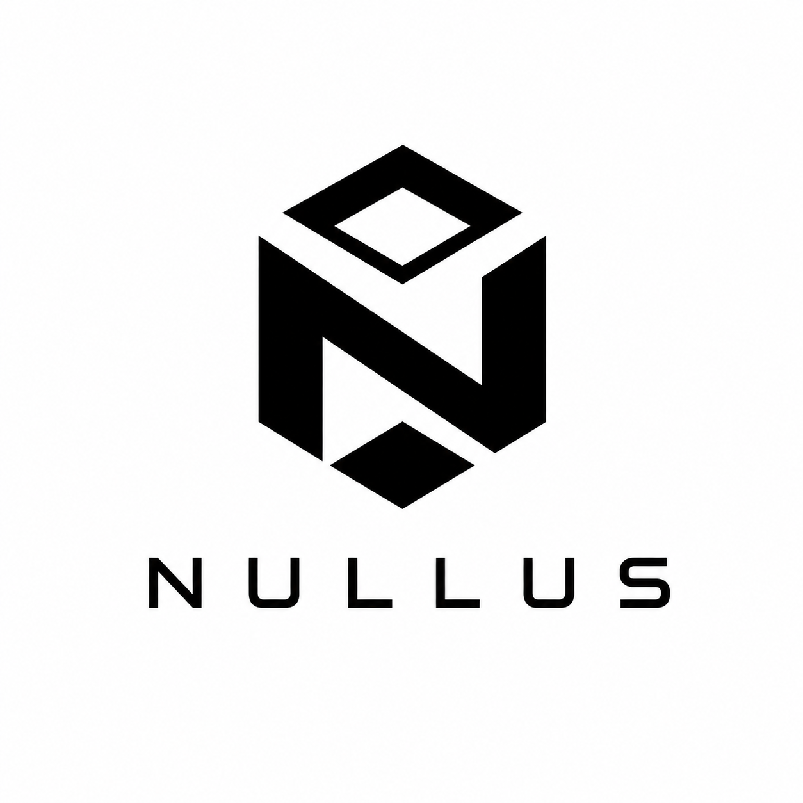
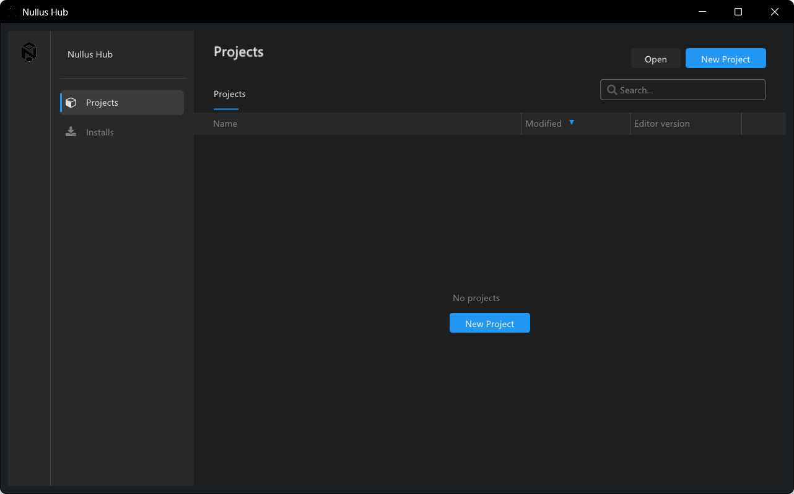
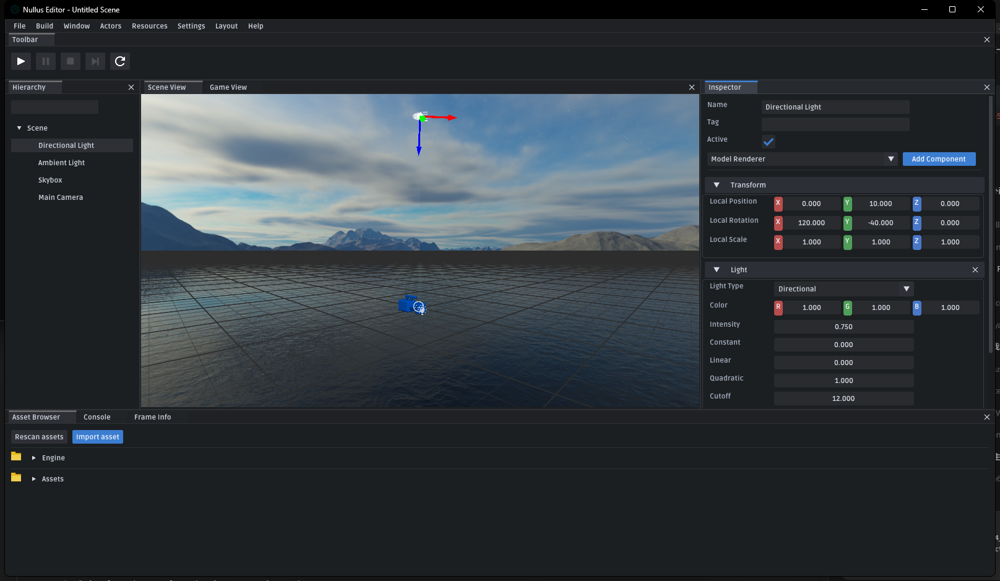

# Nullus
<p align="center">
    
</p>


[中文版](./README.md) | [English](./README.en.md)

Nullus is an evolving C++ 3D engine project focused on the scene system, resource system, editor tooling, reflection code generation, and a modern rendering pipeline.

## Preview

### Launcher



### Editor



## Highlights

- Runtime modules are split into `Base`, `Core`, `Engine`, `Math`, `Platform`, `Rendering`, and `UI`
- Ships both an editor and a runtime `Game` application on the same engine mainline
- MetaParser-based code-generated reflection system
- Reflection-driven scene and object serialization flow
- Forward and deferred scene rendering paths with `FrameGraph` integration
- Cross-platform build flow for Windows, Linux, and macOS

## Core Capabilities

- scene system: `Scene / SceneManager / GameObject / Component`
- resource system: `Model / Texture / Shader / Material`
- reflection system: MetaParser-driven code-generated reflection
- serialization: reflection-based scene and object serialization
- rendering system: forward rendering, deferred rendering, GBuffer, clustered shading
- editor tooling: core views, debug drawing, picking, Gizmo, and resource preview

## Quick Start

### Requirements

- CMake 3.16 or newer
- a compiler with C++20 support
- .NET SDK 8.0.408 (CMake bootstraps it into the repository when missing)
- Python 3.8 or newer for the source dependency setup script
- Git

### Clone

```bash
git clone https://github.com/NullusEngine/Nullus.git
cd Nullus
git submodule update --init --recursive
```

### Prepare Third-Party Dependencies

Code generation, MetaParser, and C# game scripts use the pinned .NET SDK
8.0.408. CMake downloads and verifies it into
`Tools/Dotnet/<platform>/<arch>` by default when it is missing, without changing
the system PATH. You can install it explicitly:

```powershell
.\SetupDependencies.bat --dependency dotnet-sdk
```

```bash
./SetupDependencies.sh --dependency dotnet-sdk
```

Run the dependency setup script before configuring a source build. After explicit Autodesk FBX SDK EULA acceptance, it downloads the official package, verifies its hash, and installs it to `ThirdParty/FBX/sdk/<platform>`:

```bash
./SetupDependencies.sh
```

On Windows, you can also use:

```powershell
.\SetupDependencies.bat
```

CI / headless environments must pass the acceptance signal explicitly:

```bash
NLS_ACCEPT_AUTODESK_FBX_EULA=1 ./SetupDependencies.sh --non-interactive
```

Windows CI jobs can append `--arch x64` or `--arch ARM64` when the target architecture is fixed.

### Build on Windows

```powershell
cmake -S . -B build -G "Visual Studio 17 2022" -A x64
cmake --build build --config Debug
```

If the host terminal reports `MSB6001` because `Path` and `PATH` are duplicated, use the repository environment wrapper. It only cleans the build child process and does not modify the system PATH:

```powershell
.\Tools\BuildCleanEnvironment.cmd cmake --build build --config Debug
```

You can also use the bundled scripts:

```powershell
build_windows.bat Debug
build_windows.bat Release
build_windows.bat Debug ARM64
```

### Build on Linux

```bash
./build_linux.sh debug
./build_linux.sh release
```

### Build on macOS

```bash
./build_macos.sh debug
./build_macos.sh release
```

### Run

After the build, you can run:

- `Editor`
- `Game`

### C# Script Debugging (VS Code / Visual Studio)

The Editor uses the repository-local .NET 8 SDK to build `GameScripts.dll` and a portable PDB automatically. It prepares a build at startup and queues an incremental Debug rebuild whenever the Asset Watcher sees a saved `Assets/**/*.cs` file; the new assembly is hot-reloaded at a frame boundary. The C# debugger attaches to the running Editor process. In the Editor `Debug` menu:

1. Choose `Generate VS Code Configuration` or `Generate Visual Studio Configuration` (configuration generation is not a build prerequisite).
2. In VS Code open the project-generated `Library/IDE/VSCode/Nullus.code-workspace`. In Visual Studio open `Library/IDE/VisualStudio/Nullus.Project.sln` and press F5. Both workflows reuse or start the correct Editor without a process picker.
3. Enter Play and set breakpoints in `Assets/**/*.cs` or `Managed/Nullus.GameScripts/Scripts/**/*.cs`; after saving an `Assets/**/*.cs` file, wait for the automatic Debug build before hitting the new code.

A successful build swaps the collectible CoreCLR load context at a frame boundary and preserves fields; a failed build leaves the previous assembly running. Debug configuration is written only inside the project `Library/IDE` directory and does not modify the system `PATH`.

Visual Studio reads the active solution configuration for the native Editor: `Debug|x64` starts `App/Win64_Debug_Runtime_Shared/Editor.exe`, while `Release|x64` starts `App/Win64_Release_Runtime_Shared/Editor.exe`. There is no separate Release launch profile; `Nullus: C# Scripts`, `Nullus: C# Attach and Play`, and `Nullus: Editor + C# Mixed` all follow the current `Debug|x64` / `Release|x64` selection. The VSIX is bundled at `Tools/Debug/VisualStudioExtension/Nullus.ScriptDebugger.vsix`; install it once and restart VS. See the [script debugging guide](Docs/Scripting/ScriptDebugging.en.md) for the complete workflow.

## Documentation

- Scripting API (English): `Docs/Scripting/ScriptingApi.en.md`
- 脚本 API (Chinese): `Docs/Scripting/ScriptingApi.zh-CN.md`
- Script debugging guide (English): `Docs/Scripting/ScriptDebugging.en.md`
- 脚本调试指南（中文）：`Docs/Scripting/ScriptDebugging.zh-CN.md`
- Reflection workflow (Chinese): `Docs/Reflection/ReflectionWorkflow.zh-CN.md`
- Reflection workflow (English): `Docs/Reflection/ReflectionWorkflow.en.md`
- Testing guide: `Docs/Testing.md`
- AI workflow and repository rules: `Docs/AIWorkflow.md`

## Reflection And Generation

Nullus uses MetaParser to generate reflection code:

1. the main build first builds `Tools/MetaParser`
2. `Runtime` modules run MetaParser before compilation
3. matching `*.generated.h` / `*.generated.cpp` files are emitted
4. runtime type declaration, definition, and registration are completed through generated code

Do not hand-edit anything under `Runtime/*/Gen/`.

## Platforms And CI

GitHub Actions currently covers:

- Windows
- Linux
- macOS

CI builds the project normally and continues with reflection-related and unit-test targets.

## Troubleshooting

### `Failed to Init GLFW`

This usually means the graphics environment is not ready. Check:

- whether the machine has a working desktop environment
- whether `DISPLAY` is set correctly on Linux / WSL

### MetaParser / libclang crashes

Check these first:

- the .NET 8.0.408 SDK was installed through CMake or `SetupDependencies --dependency dotnet-sdk`
- `dotnet restore` completed correctly
- you did not accidentally force the generator onto an old system `libclang`

## Contributing

Before submitting issues, suggestions, or pull requests, please read
[CONTRIBUTING.md](./CONTRIBUTING.md) and [CLA.md](./CLA.md). By contributing to
Nullus Engine, you accept the contribution license terms described there.

## License

Nullus Engine uses a custom Source-Available License. You may view and modify the source code, use it commercially, and publish games made with Nullus Engine; you may not distribute the engine source code or use this project to create a competing engine. See [LICENSE](./LICENSE) for details.
