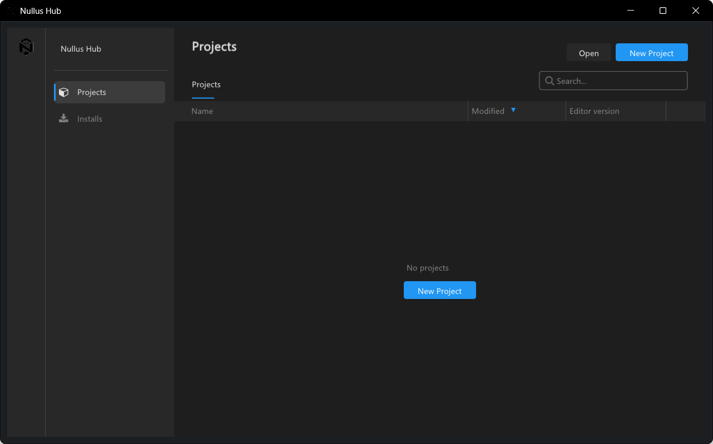
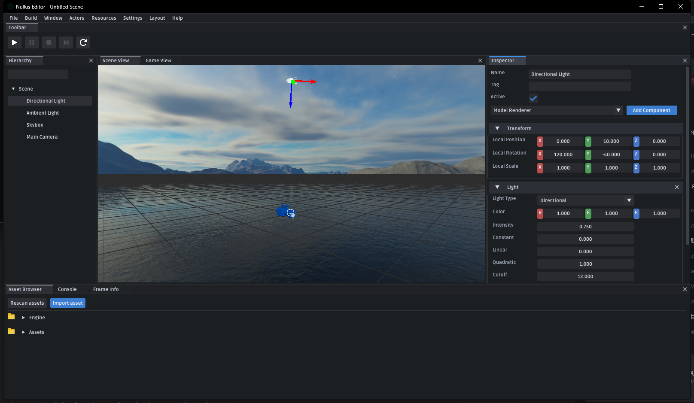

# Nullus
<p align="center">
    
</p>

## 鐣岄潰棰勮

### Launcher



### Editor



Nullus 鏄竴涓粛鍦ㄦ寔缁紨杩涗腑鐨?C++ 3D 寮曟搸椤圭洰锛屽綋鍓嶄粨搴撳悓鏃跺寘鍚繍琛屾椂銆佺紪杈戝櫒銆佽祫婧愮郴缁熴€佸弽灏勪唬鐮佺敓鎴愬伐鍏峰拰璺ㄥ钩鍙版瀯寤洪摼璺€?

## AI Workflow

Nullus includes an official Codex-oriented `Spec-Kit` scaffold plus repository-specific execution rules.

- Root workflow rules: `AGENTS.md`
- Official Codex Spec-Kit skills: `.agents/skills/`
- Spec-Kit templates and scripts: `.specify/`
- Repository guidance: `Docs/AIWorkflow.md`

Major changes should follow the spec-first workflow before implementation.
## 鏋勫缓鐘舵€?
| 骞冲彴 | 鐘舵€?|
| :-- | :-- |
| Windows | [](https://github.com/NullusEngine/Nullus/actions/workflows/build_windows.yml) |
| Linux | [](https://github.com/NullusEngine/Nullus/actions/workflows/build_linux.yml) |
| macOS | [](https://github.com/NullusEngine/Nullus/actions/workflows/build_macos.yml) |

## 椤圭洰姒傝

褰撳墠浠撳簱涓昏鍖呭惈杩欎簺閮ㄥ垎锛?
- `Runtime/`锛氳繍琛屾椂妯″潡锛屽寘鎷?`Base`銆乣Core`銆乣Engine`銆乣Math`銆乣Platform`銆乣Rendering`銆乣UI`
- `Project/Editor`锛氱紪杈戝櫒绋嬪簭
- `Project/Game`锛氳繍琛屾椂娓告垙绋嬪簭
- `Tools/MetaParser`锛氬熀浜?CppAst 鐨勫弽灏勪唬鐮佺敓鎴愬伐鍏?- `ThirdParty/`锛氱涓夋柟渚濊禆锛屽寘鎷?Assimp銆丗rameGraph銆両mGui銆乯son11 绛?
宸茬粡鎺ュ叆骞跺彲鍦ㄤ粨搴撲腑纭鐨勬牳蹇冭兘鍔涘寘鎷細

- 鍦烘櫙绯荤粺锛歚Scene / SceneManager / GameObject / Component`
- 璧勬簮绯荤粺锛歚Model / Texture / Shader / Material`
- 鍙嶅皠绯荤粺锛氬熀浜?MetaParser 鐨勪唬鐮佺敓鎴愬紡鍙嶅皠
- 搴忓垪鍖栵細鍩轰簬鏂板弽灏勭郴缁熺殑鍦烘櫙涓庡璞℃暟鎹簭鍒楀寲閾捐矾
- 娓叉煋绯荤粺锛氬墠鍚戜笌寤惰繜涓ゅ鍦烘櫙娓叉煋璺緞
- 缂栬緫鍣細鍩虹瑙嗗浘銆佽皟璇曠粯鍒躲€侀€夊彇銆丟izmo銆佽祫婧愰瑙?- 璺ㄥ钩鍙版瀯寤猴細Windows / Linux / macOS

## 鏈€杩戞洿鏂?
杩欐鏃堕棿浠撳簱閲屾瘮杈冮噸瑕佺殑鍙樻洿涓昏鏈夛細

- 鍙嶅皠绯荤粺瀹屾垚浜嗕粠鏃у吋瀹瑰眰鍒版柊鐢熸垚寮忕郴缁熺殑杩佺Щ
- 鏁板搴撳拰鏅€氱粨鏋勪綋鏀寔閫氳繃绫诲澹版槑鎺ュ叆鍙嶅皠
- 鍦烘櫙鍔犺浇銆佺紪杈戝櫒鍚姩涓庡熀纭€娓叉煋閾捐矾宸查噸鏂版墦閫?- 鎺ュ叆 `FrameGraph`锛屼富鍦烘櫙娓叉煋寮€濮嬮噰鐢?RDG 璋冨害
- 澧炲姞寤惰繜娓叉煋璺緞锛屽苟寮曞叆 clustered shading
- 鍓嶅悜娓叉煋璺緞涔熷凡杩佸埌 RDG
- `SceneRenderer` 宸叉媶鍒嗕负鍏变韩鍩虹被鍜屼袱鏉″叿浣撴覆鏌撹矾寰?
## 娓叉煋鏋舵瀯

褰撳墠娓叉煋渚х殑缁撴瀯鏄細

- `BaseSceneRenderer`
  璐熻矗鍏变韩鐨勫満鏅В鏋愩€乨rawable 鏀堕泦銆佸叕鍏辨弿杩扮鍜屽抚鍓嶅噯澶?- `ForwardSceneRenderer`
  璐熻矗鍓嶅悜涓诲満鏅覆鏌擄紝涓绘祦绋嬮€氳繃 RDG 鏋勫缓
- `DeferredSceneRenderer`
  璐熻矗寤惰繜涓诲満鏅覆鏌擄紝鍖呭惈 GBuffer銆佸厜鐓с€佸ぉ绌虹洅鍜岄€忔槑鐗╀綋闃舵

杩欎笁鑰呯殑鍏崇郴鏄細

- 鍓嶅悜鍜屽欢杩熷叡鐢ㄤ竴濂楀満鏅В鏋愪笌 graph resource 鍩虹璁炬柦
- 涓诲満鏅覆鏌撶敱 RDG 椹卞姩
- 鏃х殑娉ㄥ唽寮?pass 绯荤粺娌℃湁琚畝鍗曞垹闄わ紝鑰屾槸淇濈暀涓烘墿灞曞眰
- 缂栬緫鍣ㄩ噷鐨?grid銆乸icking銆乨ebug overlay 杩欑被鎵╁睍闃舵锛屼粛鍙互鍦ㄤ富 graph 鎵ц鍚庣户缁鐢?
鍙﹀涓ょ被鍩虹鎶借薄鐨勮亴璐ｅ涓嬶細

- `ARenderFeature`
  鐢ㄤ簬鎻愪緵鍙鐢ㄧ殑娓叉煋鑳藉姏锛屼緥濡傚紩鎿庣紦鍐层€佺伅鍏夋暟鎹€佽皟璇曞浘鍏冦€佹弿杈广€丟izmo
- `ARenderPass`
  鐜板湪涓昏鐢ㄤ簬涓诲満鏅箣澶栫殑鎵╁睍闃舵锛岃€屼笉鏄壙杞芥暣甯т富娓叉煋娴佺▼

褰撳墠娓叉煋绯荤粺宸茬粡鍏峰杩欎簺鑳藉姏锛?
- RDG 椹卞姩鐨勫墠鍚戞覆鏌撹矾寰?- RDG 椹卞姩鐨勫欢杩熸覆鏌撹矾寰?- GBuffer
- clustered shading
- 澶╃┖鐩掑悎鎴?- 閫忔槑鐗╀綋鍓嶅悜琛ョ粯
- OpenGL RHI 鎵╁睍锛氬闄勪欢 framebuffer銆乨epth blit銆佸閮ㄧ汗鐞嗗寘瑁?
## 鍙嶅皠涓?MetaParser

Nullus 褰撳墠浣跨敤鍩轰簬 CppAst.NET 鐨?MetaParser 鐢熸垚鍙嶅皠浠ｇ爜銆?
澶ц嚧娴佺▼濡備笅锛?
1. 鏋勫缓涓诲伐绋嬫椂浼氬厛鏋勫缓 `Tools/MetaParser`
2. 鍚?Runtime 妯″潡浼氬湪缂栬瘧鍓嶈繍琛?MetaParser
3. 鐢熸垚瀵瑰簲鐨?`*.generated.h` / `*.generated.cpp`
4. 杩愯鏃堕€氳繃鐢熸垚浠ｇ爜瀹屾垚绫诲瀷澹版槑銆佸畾涔夊拰娉ㄥ唽

鐩墠杩欏鍙嶅皠绯荤粺鐨勭壒鐐规槸锛?
- 鏀寔 `CLASS()` / `STRUCT()` / `GENERATED_BODY()`
- 鏀寔姣忎釜澶存枃浠跺搴斾竴缁勭敓鎴愭枃浠?- 鏀寔鎸夌被鐢熸垚闈欐€佹敞鍐屽櫒
- 鏀寔涓ら樁娈垫敞鍐岋紝閬垮厤缁ф壙閾鹃『搴忛棶棰?- 鏀寔绫诲鍙嶅皠澹版槑锛岄€傚悎鏁板绫诲瀷鍜岃交閲忕粨鏋勪綋

### 浣跨敤绾︽潫

MetaParser 渚濊禆 ClangSharp 鍜?libclang 鐨?NuGet runtime锛岃涓嶈鎵嬪姩鎶婂畠缁戝畾鍒扮郴缁熼噷鍏跺畠鏃х増 `libclang`銆?
寤鸿鍋氭硶锛?
- 瀹夎 .NET 8 SDK
- 璁?`dotnet restore` 鑷姩鎭㈠ MetaParser 渚濊禆
- 浣跨敤椤圭洰鑷甫鐨?CMake / 鏋勫缓鑴氭湰锛屼笉瑕侀澶栬鐩?MetaParser 杩愯鏃惰矾寰?
濡傛灉寮鸿鏀圭敤绯荤粺鐜閲岀殑鏃?`libclang`锛屽緢瀹规槗鍦ㄨВ鏋?AST 鎴?annotate 淇℃伅鏃跺穿婧冦€?
## 蹇€熷紑濮?
### 鐜瑕佹眰

- CMake 3.16 鍙婁互涓?- 鏀寔 C++20 鐨勭紪璇戝櫒
- .NET SDK 8.0 鍙婁互涓?- Git

鑾峰彇婧愮爜锛?
```bash
git clone https://github.com/NullusEngine/Nullus.git
cd Nullus
git submodule update --init --recursive
```

## 鏋勫缓涓庤繍琛?
### Windows

鎺ㄨ崘鐜锛歏isual Studio 2022

```powershell
cmake -S . -B build -G "Visual Studio 17 2022" -A x64
cmake --build build --config Debug
```

涔熷彲浠ョ洿鎺ヤ娇鐢ㄨ剼鏈細

```powershell
build_windows.bat Debug
build_windows.bat Release
build_windows.bat Debug ARM64
```

鏋勫缓瀹屾垚鍚庡彲浠ヨ繍琛岋細

- `Editor`
- `Game`

### Linux

Ubuntu 甯哥敤渚濊禆锛?
```bash
sudo apt update && sudo apt install -y \
  build-essential cmake ninja-build pkg-config \
  libwayland-dev wayland-protocols \
  libx11-dev libxrandr-dev libxinerama-dev libxcursor-dev libxi-dev libxext-dev libxfixes-dev libxkbcommon-dev \
  libgl1-mesa-dev libglu1-mesa-dev libvulkan-dev
```

鏋勫缓锛?
```bash
./build_linux.sh debug
./build_linux.sh release
```

绛変环鍛戒护锛?
```bash
cmake -S . -B build -G Ninja -DCMAKE_BUILD_TYPE=Debug
cmake --build build -j$(nproc)
```

杩愯锛?
```bash
cd App/Linux_Debug_Static
./Editor
./Game
```

### macOS

```bash
./build_macos.sh debug
./build_macos.sh release
```

绛変环鍛戒护锛?
```bash
cmake -S . -B build -G Xcode
cmake --build build --config Debug
```

### WSL

濡傛灉浣跨敤 WSL 骞跺甫鏈夊浘褰㈢幆澧冿細

```bash
cd App/Linux_Debug_Static
export DISPLAY=:0
./Editor
./Game
```

濡傛灉鍙槸鍚庡彴楠岃瘉锛?
```bash
sudo apt install -y xvfb
cd App/Linux_Debug_Static
xvfb-run -a ./Editor
xvfb-run -a ./Game
```

## CI 璇存槑

GitHub Actions 褰撳墠瑕嗙洊 Windows銆丩inux 鍜?macOS銆?
CI 鐨勬瀯寤虹壒鐐癸細

- 浼氬厛瀹夎 .NET 8 SDK
- MetaParser 渚濊禆閫氳繃 NuGet 鑷姩鎭㈠
- 涓嶅啀渚濊禆绯荤粺绾ф棫鐗?`libclang`
- 娓叉煋銆佸弽灏勩€佹祴璇曠洰鏍囦細鎸夊钩鍙拌剼鏈墽琛?
## 甯歌闂

### `Failed to Init GLFW`

閫氬父鏄浘褰㈢幆澧冩病鏈夊噯澶囧ソ銆?
鍙互浼樺厛妫€鏌ワ細

- 鏈満鏄惁鏈夊彲鐢ㄦ闈㈢幆澧?- Linux / WSL 涓?`DISPLAY` 鏄惁姝ｇ‘

### Shader銆佸ぉ绌虹洅鎴栬祫婧愬姞杞藉け璐?
浼樺厛妫€鏌ワ細

- 璧勬簮璺緞鏄惁瀛樺湪
- 璺緞鍒嗛殧绗︽槸鍚︾粺涓€浣跨敤 `/`
- 椤圭洰鍚姩鏃舵寚瀹氱殑鍦烘櫙鍜岃祫婧愮洰褰曟槸鍚︽纭?
### MetaParser / libclang 鐩稿叧宕╂簝

浼樺厛妫€鏌ワ細

- 鏄惁瀹夎浜?.NET 8 SDK
- 鏄惁姝ｇ‘鎵ц杩?`dotnet restore`
- 鏄惁璇敤浜嗙郴缁熼噷鐨勬棫鐗?`libclang`

## 褰撳墠鐘舵€佷笌鍚庣画鏂瑰悜

鐩墠 Nullus 宸茬粡涓嶆槸涓€涓彧鍓╁熀纭€澹冲瓙鐨勪粨搴擄紝涓婚摼璺凡缁忓彲浠ヨ鐩栵細

- 鍙嶅皠鐢熸垚
- 鍦烘櫙鍔犺浇
- 缂栬緫鍣ㄥ惎鍔?- 鍓嶅悜娓叉煋
- 寤惰繜娓叉煋
- clustered shading

鎺ヤ笅鏉ユ洿鍊煎緱缁х画鎺ㄨ繘鐨勬柟鍚戝寘鎷細

- 娓叉煋渚ц繘涓€姝ユ敹鏁?RHI 鎶借薄
- 鏇村 editor 宸ュ叿鍜岃祫浜у伐浣滄祦
- 鏇村畬鏁寸殑鑷姩鍖栨祴璇?- 搴忓垪鍖栨牸寮忎笌璧勬簮鏍煎紡鏂囨。鍖?
## License

濡傛灉鍚庣画浠撳簱鍗曠嫭琛ュ厖璁稿彲璇佹枃浠讹紝璇蜂互浠撳簱涓殑姝ｅ紡 License 鏂囦欢涓哄噯銆?
