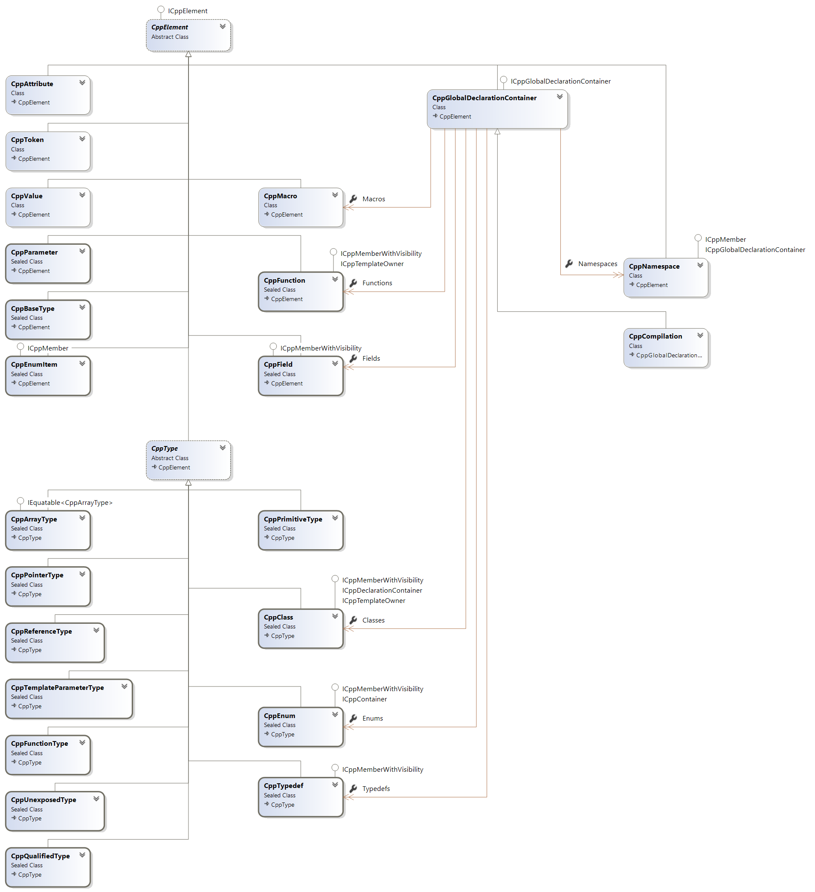

# CppAst User Guide

## Overview

The entry point for parsing a C/C++ header files with CppAst is the class [`CppParser.Parse`](../src/CppAst/CppParser.cs) methods:

- `CppParser.Parse` allows to parse directly C++ content
- `CppParser.ParseFile` allows to parse a single C++ file from a specified file path
- `CppParser.ParseFiles` allows to parse a multiple C++ file from the disk

These methods return a [`CppCompilation`](../src/CppAst/CppCompilation.cs) object which contains:

- A property `HasErrors` sets to `true` if any `CppParser.Parse` methods failed to compile the header files.
- A `Diagnostics` property to fetch any compilation errors
- Several list of C/C++ elements via the `CppCompilation` properties:
  - `Macros`
  - `Classes`
  - `Enums`
  - `Fields`
  - `Functions`
  - `Typedefs`
  - `Namespaces`
- An access to all C++ elements parsed coming from system includes via the `System` property
  which is itself a container for macros, enums, fields, functions...etc.

For example to print all the struct and fields define in the global scope:

```C#
// Print all structs with all fields
foreach(var cppStruct in compilation.Classes)
{
    // Skip non struct
    if (cppStruct.ClassKind != CppClassKind.Struct) continue;
    Console.WriteLine($"struct {cppStruct.Name}");

    // Print all fields
    foreach(var cppField in cppStruct.Fields)
        Console.WriteLine($"   {cppField}");

    Console.WriteLine("}");
}
```

## Class diagram



## Parser options

You can configure the behavior of the parser by passing a [`CppParserOptions`]((../src/CppAst/CppParserOptions.cs)) object:

```c#
var options = new CppParserOptions()
{
    // Pass the defines -DMYDEFINE to the C++ parser
    Defines = {
        "MYDEFINE"
    }
};
var compilation = CppParser.ParseFile("...",  options);
```

## Source information

All elements inherit from the base class [`CppElement`](../src/CppAst/CppElement.cs) that provides precise source span/location information via the property `CppElement.Span`

## Containers

A few C/C++ elements can be container of other C++ elements:

- A [`CppCompilation`](../src/CppAst/CppCompilation.cs) root container for all global scope C/C++ elements\
- A [`CppClass`](../src/CppAst/CppClass.cs) can contain fields, classes/structs/unions, methods...
- A [`CppNamespace`](../src/CppAst/CppNamespace.cs) can contain fields, classes/structs/unions, methods, nested namespaces

## Type System

All the type class in CppAst inherit from the class `CppType`:

- [`CppPrimitiveType`](../src/CppAst/CppPrimitiveType.cs) for all primitive types (e.g `int`, `char`, `unsigned int`)
- [`CppClass`](../src/CppAst/CppClass.cs) for struct, class and union. Use the property `CppClass.ClassKind` to detect which type is the underlying class
- [`CppEnum`](../src/CppAst/CppEnum.cs) for enum types (C++ scoped and regular enums)
- [`CppTypedef`](../src/CppAst/CppTypedef.cs) for a typedef (e.g `typedef int MyInteger`)
- [`CppPointerType`](../src/CppAst/CppPointerType.cs) for pointer types (e.g `int*`)
- [`CppReferenceType`](../src/CppAst/CppReferenceType.cs) for reference types (e.g `int&`)
- [`CppArrayType`](../src/CppAst/CppArrayType.cs) for array types (e.g `int[5]`)
- [`CppQualifiedType`](../src/CppAst/CppQualifiedType.cs) for qualified types (e.g `const int`)
- [`CppFunctionType`]((../src/CppAst/CppFunctionType.cs)) for function types (e.g `void (*)(int, int)`)

## Advanced

### Parsing macros

By default, CppAst doesn't parse macros. This can be enabled via `CppParserOptions.ParseMacros = true`

### Parsing Windows/MSVC headers

If you are looking to parse Windows headers with the behavior of the MSVC C++ compiler, you can configure

```c#
var options = new CppParserOptions().ConfigureForWindowsMsvc();
```

### Disable typedef auto-squash

By default, CppAst will squash a typedef to an un-named struct/union, rename the struct and discard the typedef:

```C
typedef struct { int a; int b; } MyStruct;
```

will be parsed as named C++ struct and available via `CppCompilation.Classes`

```C++
struct MyStruct { int a; int b; };
```

To disable this feature you should setup `CppParserOptions.AutoSquashTypedef = false`
